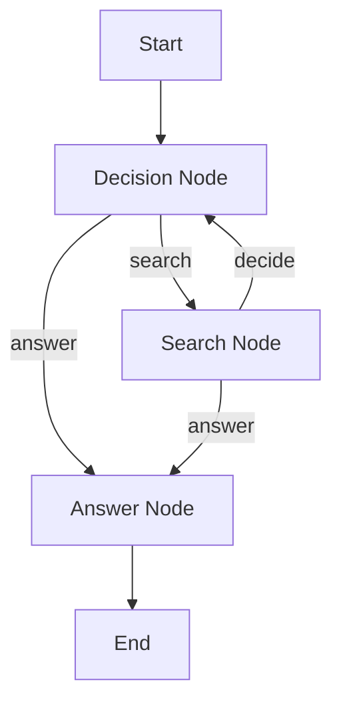

# PocketFlow Agent

A simple AI agent built with PocketFlow that can decide whether to search for information or answer questions directly.

## Overview

This agent implements a basic decision-making flow:
1. **Decision Node**: Determines if the query requires a search or can be answered directly
2. **Search Node**: Performs a search using DuckDuckGo (placeholder implementation)
3. **Answer Node**: Generates an answer using OpenAI (placeholder implementation)

## Architecture



## Files

- `decision_node.py`: Node that chooses "search" if "search" is in the input, otherwise "answer"
- `search_node.py`: Node that calls `search_duckduckgo` utility and routes back to DecisionNode
- `answer_node.py`: Node that calls `call_openai` utility and returns the final answer
- `utils.py`: Utility functions for search and LLM calls (placeholder implementations)
- `flow.py`: Main flow definition and convenience functions
- `test_agent.py`: Basic component tests
- `test_full_flow.py`: Comprehensive flow tests

## Usage

### Basic Usage

```python
from codefiles.pocketflow_agent.flow import run_agent

# Direct question (no search)
result = run_agent("What is machine learning?")
print(result['answer'])

# Search query
result = run_agent("search for Python tutorials")
print(result['answer'])
```

### Advanced Usage

```python
from codefiles.pocketflow_agent.flow import create_agent_flow

# Create custom shared store
shared = {
    "query": "search for information about AI",
    "original_query": "search for information about AI",
    "decision": None,
    "search_result": None,
    "answer": None,
    "search_count": 0,
    "max_searches": 3  # Custom limit
}

# Create and run flow
flow = create_agent_flow()
flow.run(shared)

print(f"Decision: {shared['decision']}")
print(f"Search Count: {shared['search_count']}")
print(f"Answer: {shared['answer']}")
```

## Configuration

The agent includes loop prevention to avoid infinite search cycles:

- `max_searches`: Maximum number of searches allowed (default: 2)
- `search_count`: Current number of searches performed

## Testing

Run the tests to verify functionality:

```bash
# Basic component tests
python3 -m codefiles.pocketflow_agent.test_agent

# Comprehensive flow tests
python3 -m codefiles.pocketflow_agent.test_full_flow
```

## Customization

### Adding Real API Calls

Replace the placeholder implementations in `utils.py`:

```python
def search_duckduckgo(query):
    # Replace with actual DuckDuckGo API call
    from duckduckgo_search import ddg
    results = ddg(query, max_results=5)
    return str(results)

def call_openai(prompt):
    # Replace with actual OpenAI API call
    import openai
    response = openai.ChatCompletion.create(
        model="gpt-3.5-turbo",
        messages=[{"role": "user", "content": prompt}]
    )
    return response.choices[0].message.content
```

### Modifying Decision Logic

Update `decision_node.py` to change how decisions are made:

```python
def exec(self, prep_res):
    query = prep_res.lower()
    
    # Custom decision logic
    if any(keyword in query for keyword in ["search", "find", "look up"]):
        return "search"
    else:
        return "answer"
```

### Adding New Nodes

Create new nodes by inheriting from `Node` and implementing the `prep()`, `exec()`, and `post()` methods:

```python
from pocketflow import Node

class CustomNode(Node):
    def prep(self, shared):
        # Read data from shared store
        return shared["some_key"]
    
    def exec(self, prep_res):
        # Process the data
        return processed_result
    
    def post(self, shared, prep_res, exec_res):
        # Store results and return action
        shared["result"] = exec_res
        return "next_action"
```

## Dependencies

- PocketFlow framework
- Python 3.6+

## License

This project is part of the PocketFlow framework examples.